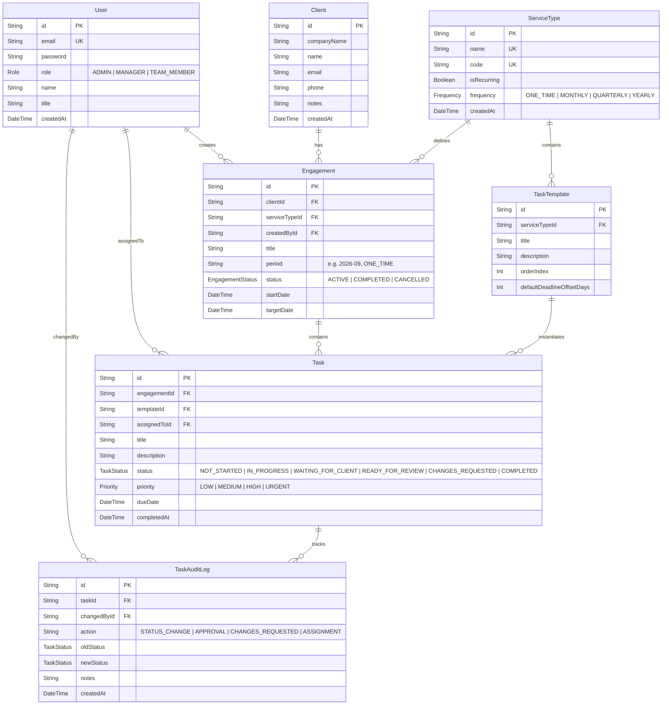
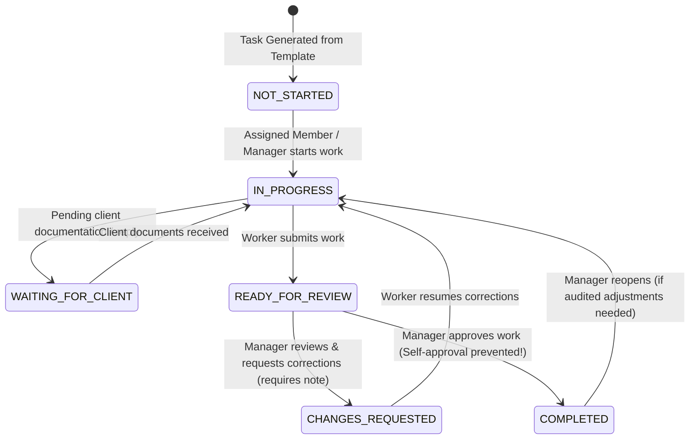

# Technical Design Note: Task & Engagement Management Tool
**Author:** Full Stack Engineering Candidate  
**Date:** September 2026  
**System Name:** NexusTask (Professional Services Engagement & Workflow Engine)

---

## 1. System Architecture

```
┌─────────────────────────────────────────────────────────────────────────────┐
│                            CLIENT TIER (Frontend)                           │
│  React 19 + TypeScript + Vite                                               │
│  - Vanilla CSS Modern Design System (Glassmorphism, CSS Custom Properties)  │
│  - Quick Persona Switcher (Admin, Managers, Team Members)                   │
│  - Dashboard Metrics (5 Core KPIs), Kanban/Table Workflows, Admin Catalog    │
└──────────────────────────────────────┬──────────────────────────────────────┘
                                       │ HTTP / REST (JWT Bearer Auth)
                                       ▼
┌─────────────────────────────────────────────────────────────────────────────┐
│                          APPLICATION TIER (Backend)                         │
│  Node.js + Express + TypeScript                                             │
│  ┌──────────────────────────────┬────────────────────────────────────────┐  │
│  │ Middlewares:                 │ Domain Services:                       │  │
│  │  - Auth (JWT verify)         │  - WorkflowService (State Machine)     │  │
│  │  - RoleGuard (RBAC)          │  - EngagementService (Recurring Roll)  │  │
│  │  - Zod Request Validation    │  - TaskService (Filters & Assignments) │  │
│  │  - Centralized Error Handler │  - DashboardService (KPI Aggregation)  │  │
│  └──────────────────────────────┴────────────────────────────────────────┘  │
└──────────────────────────────────────┬──────────────────────────────────────┘
                                       │ Prisma ORM ($transaction, strict schema)
                                       ▼
┌─────────────────────────────────────────────────────────────────────────────┐
│                            DATA TIER (Database)                             │
│  SQLite (Local/Dev/Test) / PostgreSQL (Cloud/Production)                    │
│  - Tables: User, Client, ServiceType, TaskTemplate, Engagement,             │
│            Task, TaskAuditLog                                               │
│  - Compound Unique Constraints: @@unique([clientId, serviceTypeId, period]) │
│  - Foreign Key Constraints & Composite Indexes                              │
└─────────────────────────────────────────────────────────────────────────────┘
```

### Component Breakdown
1. **Frontend**:
   - **Framework**: React 19 with Vite and TypeScript.
   - **Styling**: Vanilla CSS design system utilizing CSS variables, responsive grids, dark/glassmorphic elevation layers, micro-animations, and accessible color contrasts.
   - **State & Communication**: Context-based authentication with 1-click persona switching (`Admin`, `Manager`, `Team Member`), modular REST API client (`fetch` abstraction with bearer injection).
2. **Backend**:
   - **Runtime**: Node.js (v24 LTS) with Express and TypeScript.
   - **Layering**: Strictly decoupled 4-layer architecture:
     - `Routes`: Declarative HTTP routing.
     - `Middlewares`: JWT authentication, role authorization, Zod schema validation, global error handling.
     - `Services`: Business logic, transactional workflows, state machine validation, audit trails.
     - `Data Layer`: Prisma ORM singleton managing connections, transactions, and relational queries.
3. **Database**:
   - Relational database schema with enforced referential integrity (`RESTRICT` on root entities, `CASCADE` on lifecycle-bound entities like tasks and audit logs).
   - Compound unique index `[clientId, serviceTypeId, period]` preventing duplicate recurring engagements at the database level.
4. **Authentication**:
   - Stateless JWT tokens containing user identity (`id`, `email`, `role`, `title`), signed with HMAC-SHA256 and verified via Express middleware.
5. **Deployment**:
   - Container-ready structure: Docker multi-stage build running Node backend, serving static frontend assets via Nginx/Caddy or Node static server, with environment-configurable database connection (`DATABASE_URL`).

---

## 2. Database Schema & Entity-Relationship Model (ERD)



### Primary & Foreign Keys and Constraints
- **Compound Unique Constraint**:
  `Engagement: @@unique([clientId, serviceTypeId, period])`
  Guarantees that no two engagements can be created for the same client, service, and billing period (e.g., `(Client_Apex, GST_Monthly, "2026-09")` can only exist once).
- **Referential Integrity**:
  - `Engagement.clientId` references `Client.id` with `onDelete: Restrict` (prevents deleting active clients).
  - `Task.engagementId` references `Engagement.id` with `onDelete: Cascade` (cleaning up engagement cleans tasks).
  - `TaskAuditLog.taskId` references `Task.id` with `onDelete: Cascade`.
  - `Task.assignedToId` references `User.id` with `onDelete: SetNull` (retaining tasks if users change).
- **Relevant Indexes**:
  - `Task(assignedToId)`: Fast lookup of tasks assigned to a specific specialist.
  - `Task(status)`: Rapid filtering for dashboard metric counters.
  - `Task(dueDate)`: Accelerated range scans for overdue and due-today queries.
  - `Task(engagementId)`: Rapid joins for engagement progress calculations.
  - `TaskAuditLog(taskId)`: Instant chronological retrieval of task history.

---

## 3. Backend Design & Code Structure

### API & Service Structure
The backend follows strict separation of concerns across layers:
- `src/validators/`: Declarative input contracts using **Zod**. Every incoming request payload (`body`, `query`, `params`) is parsed and validated before touching any business logic. Invalid inputs fail fast with HTTP 400 and structured field error arrays.
- `src/middleware/`:
  - `auth.ts`: Verifies incoming JWT Bearer tokens and attaches `req.user` (`AuthenticatedUser`).
  - `requireRoles(...roles)`: Role-Based Access Control (RBAC) guard verifying that the authenticated user possesses authorized role privileges (`ADMIN`, `MANAGER`, `TEAM_MEMBER`).
  - `errorHandler.ts`: Centralized exception interceptor. Maps domain errors (`AppError`), validation failures (`ZodError`), and database constraint violations (`P2002`, `P2025`) to clean JSON responses (`{ success: false, message, errors }`).
- `src/services/`:
  - `WorkflowService`: Encapsulates all finite state machine rules, transition guards, role permission checks, and audit logging.
  - `EngagementService`: Encapsulates transactional creation of engagements, template cloning into tasks, and recurring period roll-overs.
  - `TaskService`: Handles multi-criteria querying, search filtering, and ad-hoc task creation.
  - `DashboardService`: Aggregates the 5 required KPI counters (`openTasks`, `overdueTasks`, `dueTodayTasks`, `waitingForClient`, `waitingForReview`).
  - `AdminService`: Manages client entities, service types, and task templates.

---

## 4. Authentication & Authorization

Permissions are enforced strictly **server-side** on every route and domain service:

### Role Permissions Matrix
| Action | Admin | Manager | Team Member | Server-Side Enforcement Point |
|---|:---:|:---:|:---:|---|
| **Manage Users & Clients** | ✅ | View Only | ❌ | `requireRoles(ADMIN, MANAGER)` middleware |
| **Create Service Types & Templates** | ✅ | ❌ | ❌ | `requireRoles(ADMIN)` middleware |
| **Create / Manage Engagements** | ✅ | ✅ | ❌ | `requireRoles(ADMIN, MANAGER)` middleware |
| **Generate Next Period Engagement** | ✅ | ✅ | ❌ | `requireRoles(ADMIN, MANAGER)` middleware |
| **Assign / Reassign Tasks & Set Due Dates**| ✅ | ✅ | ❌ | `WorkflowService.assignOrUpdateTask` checks role; rejects others with `403 Forbidden` |
| **View Assigned Tasks** | ✅ (All) | ✅ (All) | ✅ (Assigned) | `TaskService.listTasks` applies `assignedToId = user.id` scope |
| **Advance Status (`NOT_STARTED` → `IN_PROGRESS`)** | ✅ | ✅ | ✅ (Self) | `WorkflowService`: Assigned member or self-claim |
| **Mark `WAITING_FOR_CLIENT`** | ✅ | ✅ | ✅ (Self) | `WorkflowService`: Task owner with optional note |
| **Submit Work (`READY_FOR_REVIEW`)** | ✅ | ✅ | ✅ (Self) | `WorkflowService`: Task owner triggers submission |
| **Approve Work (`READY_FOR_REVIEW` → `COMPLETED`)** | ✅ | ✅ | ❌ | **Strict rule:** `WorkflowService` rejects `TEAM_MEMBER` with `403 Forbidden`. Prevents self-approval! |
| **Request Changes (`READY_FOR_REVIEW` → `CHANGES_REQUESTED`)** | ✅ | ✅ | ❌ | `WorkflowService` rejects `TEAM_MEMBER` with `403 Forbidden`. Requires mandatory feedback notes. |
| **Update Another Member's Task** | ✅ | ✅ | ❌ | `WorkflowService` validates `task.assignedToId === currentUser.id`; rejects mismatch with `403 Forbidden`. |

---

## 5. Recurring Task Generation & Duplicate Prevention

### Generation Workflow
1. For an active recurring engagement (e.g. *Apex Global - Monthly GST Compliance 2026-09*), the manager triggers `/api/engagements/:id/next-period`.
2. The service parses the current period string and computes the subsequent period based on frequency:
   - Monthly: `2026-09` → `2026-10` (handles year rollover: `2026-12` → `2027-01`).
   - Quarterly: `2026-Q3` → `2026-Q4` (rollover: `2026-Q4` → `2027-Q1`).
   - Yearly: `2026` → `2027`.
3. The generation executes inside an atomic **`prisma.$transaction`**:
   - Queries `tx.engagement.findUnique` matching `[clientId, serviceTypeId, nextPeriod]`.
   - If a record exists, execution immediately aborts and raises an `AppError('Duplicate engagement conflict: ...', 409)`.
   - Creates the new `Engagement` entity.
   - Queries all associated `TaskTemplate` records for the service.
   - Clones each template into a new `Task` record with calculated deadlines (`nextStartDate + offsetDays`).
   - Retains previous assignee mappings so the same specialist handles the client's recurring tasks.
   - Generates initial audit log entries (`action: 'CREATED'`).

### Edge Case Analysis
- **What happens if the operation runs twice?**
  - The first call commits the new engagement.
  - The second call is intercepted either by the pre-check query or by the database unique index `[clientId, serviceTypeId, period]`. Both return a `409 Conflict` error without generating orphan tasks.
- **What happens if creation fails partway through?**
  - Because all operations are wrapped inside a database transaction (`prisma.$transaction`), any failure during task generation rolls back the engagement creation completely. No partial or corrupt state remains.

---

## 6. Workflow Rules & State Machine

The task lifecycle adheres to a deterministic finite state machine (FSM):



### Transition Enforcement Rules
- **Invalid jumps are rejected**: Transitioning directly from `NOT_STARTED` to `COMPLETED` or `READY_FOR_REVIEW` is rejected with `400 Bad Request`.
- **No Self-Approval**: A team member attempting to transition their own task from `READY_FOR_REVIEW` to `COMPLETED` is rejected with `403 Forbidden: Team members cannot approve tasks. Manager review is required.`
- **Mandatory Feedback**: Transitioning to `CHANGES_REQUESTED` without explicit comments is rejected with `400 Bad Request`.
- **Comprehensive Audit Trail**: Every single transition records a `TaskAuditLog` row with `taskId`, `changedById`, `oldStatus`, `newStatus`, `action`, `notes`, and `createdAt`.

---

## 7. Automated Backend Test Suite

The automated test suite (`backend/src/tests/api.test.ts`) contains **12 automated integration tests** running via Vitest & Supertest:

| # | Test Case Description | Verified Behavior & HTTP Status |
|---|---|---|
| 1 | **Unauthorized task update is rejected** | Team member attempting to update another member's task receives `403 Forbidden`. |
| 2 | **Unauthorized task assignment is rejected** | Team member attempting to assign tasks or alter deadlines receives `403 Forbidden`. |
| 3 | **Duplicate recurring engagement is rejected** | Creating an engagement for existing `(client, service, period)` receives `409 Conflict`. |
| 4 | **Duplicate next period generation is rejected** | Generating next period when period already exists is blocked with `409 Conflict`. |
| 5 | **Direct skip to `COMPLETED` is rejected** | `NOT_STARTED` → `COMPLETED` without workflow progression returns `400 Bad Request`. |
| 6 | **Direct skip to `READY_FOR_REVIEW` is rejected** | `NOT_STARTED` → `READY_FOR_REVIEW` returns `400 Bad Request`. |
| 7 | **Valid status progression** | `NOT_STARTED` → `IN_PROGRESS` transitions successfully and returns `200 OK`. |
| 8 | **Waiting for client workflow loop** | `IN_PROGRESS` → `WAITING_FOR_CLIENT` → `IN_PROGRESS` succeeds with notes and returns `200 OK`. |
| 9 | **Self-approval is rejected** | Team member attempting to approve work in `READY_FOR_REVIEW` returns `403 Forbidden`. |
| 10 | **Manager approval works correctly** | Manager approving work in `READY_FOR_REVIEW` marks task `COMPLETED` with timestamp and audit log. |
| 11 | **Change request requires feedback notes** | Empty feedback on `CHANGES_REQUESTED` returns `400 Bad Request`; valid notes transition to `CHANGES_REQUESTED`. |
| 12 | **Dashboard KPI accuracy** | `/api/dashboard/metrics` calculates all 5 required metric counters accurately. |

---

## 8. Production Considerations (Scaling to 5 Million Tasks)

If the platform grows to **5 million tasks**, several architectural modifications would be required:

### 1. Database Indexes & Query Optimization
- **Composite Partial Indexes**:
  Create partial indexes in PostgreSQL for open work:
  ```sql
  CREATE INDEX idx_tasks_open_overdue ON tasks (due_date) WHERE status != 'COMPLETED';
  CREATE INDEX idx_tasks_status_assigned ON tasks (assigned_to_id, status);
  ```
- **Partitioning**:
  Partition the `Task` and `TaskAuditLog` tables by range on `created_at` (e.g. monthly or quarterly partitions) or hash partition by `client_id` / tenant.
- **Cold Storage Archiving**:
  Completed engagements and tasks older than 12 months can be moved to an archive table or compressed columnar store (e.g., ClickHouse/Parquet) for regulatory compliance while keeping the operational table compact.

### 2. Cursor-Based Pagination
- Offset-based pagination (`OFFSET 100000 LIMIT 50`) degrades significantly on large datasets due to full-index traversals.
- Replace with **cursor-based (keyset) pagination**:
  ```sql
  SELECT * FROM tasks WHERE (due_date, id) > ($lastDueDate, $lastId) ORDER BY due_date ASC, id ASC LIMIT 50;
  ```

### 3. Background Job Processing
- Decouple recurring engagement generation from HTTP request cycles using **BullMQ + Redis** or AWS SQS.
- A nightly scheduled worker (Cron job) queries recurring services due for the upcoming period and processes batch creation through distributed worker queues with automatic retry, jitter, and dead-letter queues (DLQ).

### 4. Dashboard Queries & Real-time Caching
- Running `COUNT(*)` over millions of rows on every dashboard load is cost-prohibitive.
- **Materialized Views**: Maintain a materialized summary table or use PostgreSQL `LISTEN/NOTIFY` triggers to maintain real-time count aggregates per client/user.
- **Redis Cache**: Cache metric counters in Redis with a 60-second TTL or increment/decrement counters atomically on task status transitions using Redis `HINCRBY`.

### 5. Logging, Observability & Tracing
- Replace `console.log` with structured JSON logging using **Pino** or **Winston**.
- Implement distributed tracing with **OpenTelemetry** and export traces to Jaeger/Datadog to monitor database transaction latencies.
- Implement rate limiting (e.g. `express-rate-limit` with Redis store) to protect endpoints from abuse.

---

## 9. Architectural Trade-offs & Decisions

1. **SQLite (Prisma) vs PostgreSQL for Assignment Execution**:
   - *Decision*: Configured SQLite with Prisma ORM for seamless out-of-the-box evaluation without requiring reviewers to provision local PostgreSQL databases or Docker containers.
   - *Trade-off*: SQLite lacks native partitioned tables and stored procedures, but Prisma abstracts the ORM layer such that switching to PostgreSQL requires only changing `provider = "postgresql"` in `schema.prisma` without rewriting any domain services.
2. **Domain Service State Machine vs Database Enums / Triggers**:
   - *Decision*: Encapsulated state transition rules in TypeScript domain services (`WorkflowService`) rather than purely database triggers.
   - *Trade-off*: Validating in code provides fine-grained contextual error messages and role-aware guards (e.g. distinguishing whether a manager or team member is making the call) and makes unit/integration testing fast and expressive.
3. **Compound Unique Constraints vs Soft Locks**:
   - *Decision*: Enforced duplicate prevention using compound database unique constraints `[clientId, serviceTypeId, period]` combined with application-level transactions.
   - *Trade-off*: Unique constraints strictly prevent race conditions even under concurrent requests across distributed instances without the overhead of distributed Redis locks.
